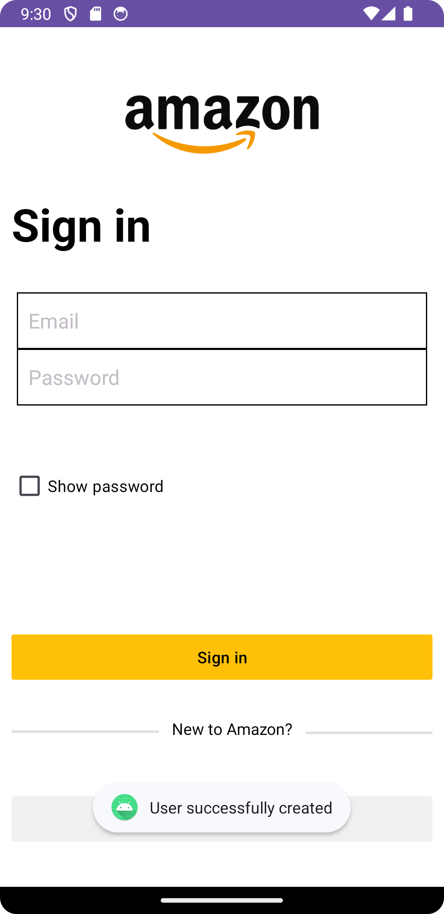

Amazon E-Commerce App

Starting Screen

No Password entered

Password with show password checkbox checked

Validating email and password

Creating new user - No data entered

Creating new user - password less then 6 characters

Creating new user - passwords do not match

Creating new user - username already exist

Creating new user - email already exist

Creating new user - user successfully created

Successful sign in

Toast message for clicking on Home and kitchen

Toast message for clicking on Pet supplies

Toast message for clicking on Beauty and personal care

Toast message for clicking on toys and games

